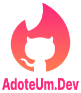

    

        
    

    

        <!-- uncomment after enabled workflow -->
        <!--
        
        -->
        
        
        
        
    

    

        <!-- base64 flags are available at https://www.phoca.cz/cssflags/ -->
        <!-- pt-BR> -->
        <!-- uncoment if implement documentation in other language
        
        -->
    

    

        <a href="#about">About</a> |
        <a href="#contributing">Contributing</a> |
        <a href="#credits">Credits</a> |
        <a href="#license">License</a>
    

## About

`AdoteUm.Dev` has the proposal to connect people who are looking for developers for their projects. AdoteUmDev is a web application, developed in PHP language and the Laravel Framework.

### Tecnologies

- **TALL Stack**;
- **PHP 8.0+**;
- **Laravel Framework 8.40+**;
- **Laravel Sail (Docker)**;
- **Laravel Horizon**;
- **Laravel Echo**;
- **Laravel Socialite**;
- **Pest PHP for Tests**;
- **Redis**;
- **Maria DB**;
- **Supervisor**;
- **SendPulse**;
- **Bugsnag**;
- **AWS**.

 

📝 Note
> If the subscribers 10K goal is achieved by the end of the playlist, a version of the mobile application will be developed in Flutter.

 

## Contributing

Thank you for considering contributing to the `AdoteUm.Dev`, the contribution guide can be found in [Contributing Guide](./.github/CONTRIBUTING.md).

### Code of Conduct

In order to ensure that the `Beer and Code` community is welcoming to all, please review and abide by the [Beer and Code Guide](https://github.com/beerandcodeteam/guia).

 

## Credits

- [Beer and Code](https://github.com/beerandcodeteam)
- [All Contributors](../../contributors)

 

## License

The AdoteUm.Dev web application is open-sourced software licensed under the [MIT license](https://opensource.org/licenses/MIT).
